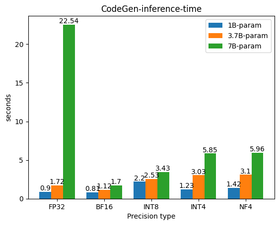
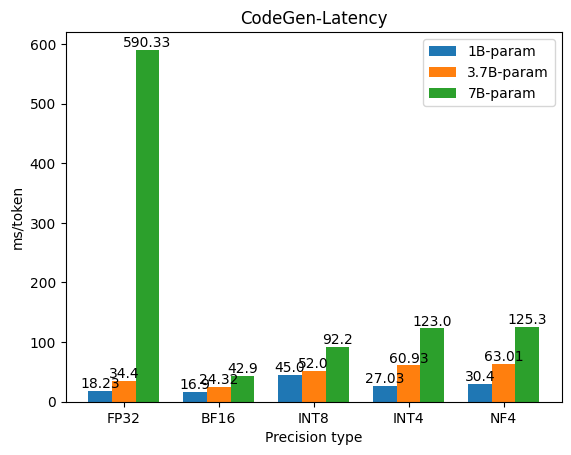
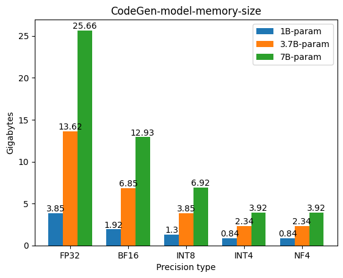
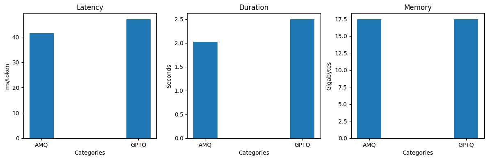

# Model optimization and quantization(EMLO assignment 24)
This project focuses on exploring different quantization technique to Changing precision of LLM models between multiple precision. This project is part of assignment from EMLO course.

## Introduction
Here the project is divided into two parts:
- #### Part-1: Testing CodeGen models with different trained parameters i.e. 1B, 3.7B and 7B. And benchmarking these models against different possible precisions like FP32, BF16m, INT8, INT4 and NF4.

- #### Part-2: Running CodeLLAMA model with 34B parameter and benchmarking this model in AWQ and GPTQ quantized version.

## Part-1: CodeGen2
`Part-1/` directory contains code to setup this process. A python script will be responsible for running this models in various precision. 
 
Below are the results ploted:
 

 

Some of the conclusion which can be derived from above graphs are:
1. FP32 with 7B param model is the most unoptimized combination.
2. Best middle ground for best performance vs latency vs size will be 5.7B param with Int8 precision.

## Part-2: CodeLLAMA
`Part-2/` directory contains code to setup CodeLLAMA model which has 34B parameters. Below are the results:

Above results shows that AWQ quantized model are better in terms of latency and inference time, but both of them are roughfly of same size.